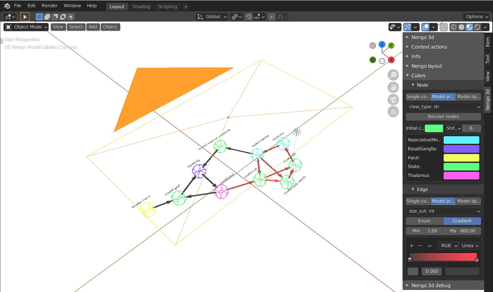
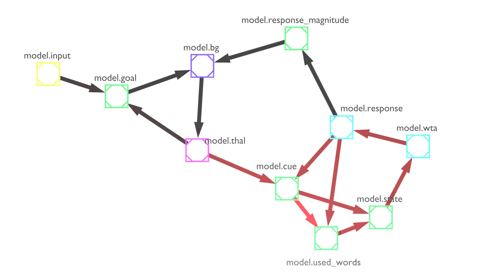

# Nengo 3d

3d interactive neural network visualization toolkit for Nengo simulator

python + Nengo + Blender




## Install and run

1. Clone source of this repo and make sure you can `import nengo_3d`. Also install `requirements.txt`
2. Make sure you have `blender.exe` in `PATH`. If not, use `blender=...` argument in `nengo_3d.GUI`.
3. Use snippet:

```python
if __name__ == "__main__":
    import nengo_3d

    nengo_3d.GUI(filename=__file__, model=model, local_vars=locals()).start()
```

On first run 3 things will be linked (no copying) to Blender (somewhere around this
path `%appdata%\Blender Foundation\Blender\2.93\scripts\startup\bl_app_templates_user`):

- Blender [app template](https://docs.blender.org/manual/en/latest/advanced/app_templates.html) named "Nengo App"
- Blender addon called "bl_nengo_3d"
- `pip` will install third party modules to use with app template (internet connection required)

## File structure

`nengo_3d` - python module to use in your project

`nengo_3d/nengo_app` - blender template

`nengo_3d/nengo_app/bl_nengo_3d` - blender addon (automatic installation)

`nengo_3d/nengo_app/dependencies` - scripts for installing addon and 3rt party modules

`nengo_3d/nengo_app/blender_pip_modules` - blender addon dependencies (automatic installation, when starting
nengo_3d.GUI)

## Issues

- [x] ~~do not store pointer directly to blender object, refer to them by name~~
- [x] ~~performance in UI panels is not great. Advanced caching is needed or conversion to dedicated operators. Close
  addon panels that you do not use to improve performance~~
- [x] ~~re-test save model state and restoring connection~~
- [ ] lines example is not working
- [ ] Undo system sometimes crashes blender when using custom operators (partially fixed)
- [ ] when saved blend is loaded, and the model is changed, the number of lines might not be the same. Refresh the
  number of lines in chart?
- [ ] when `Sampple every` is greater than 1 `Play` functionality breaks a bit
- [ ] rendering animation sometimes while changing mesh crashes Blender (known bug)

## What can be done better/differently?

- allow for scrubbing data and stepping simulation even if reset is required
- in color panel enum: gather attributes to static collection, so that bpy.rna does not spam with warnings and unknown
  type errors when not connected. This will fix issue when color enum changes unexpectedly when expanding network
- communication with server - use either full rest API (for clarity) or binary format (for speed)
- create broadcast server, so that Blender can be kept open and only receive model changes
- interaction from Blender to model? (interactive input by slider, adding new node, ...)
- remote debugging model from Blender?
- automatic rendering?
- align items to camera view?
- add progress bar
- views on data from multiple runs? 
- save gathered data to external file?